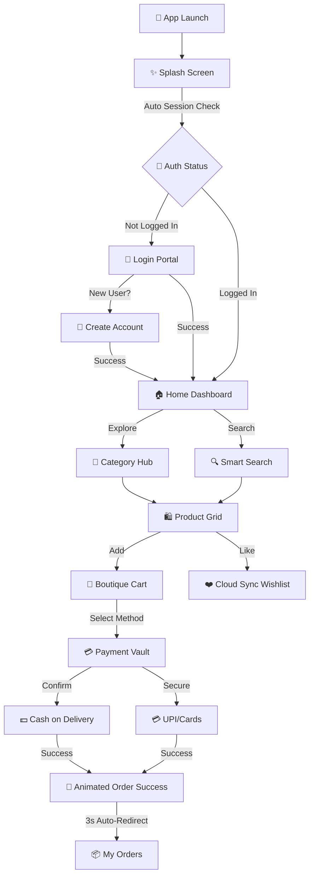

# ✨ Aura Mart — *The Future of Premium Shopping* ✨

<div align="center">


**Aura Mart** is a high-performance, premium e-commerce application crafted with **Flutter** and powered by **Firebase**. It offers a seamless, secure, and visually stunning shopping experience designed for the modern user.

[Explore the Flow](#-visual-flow) • [Key Features](#-premium-features) • [Workflow](#-the-journey) • [Installation](#-installation--setup)

</div>

---

## 📸 Visual Flow



---

## 💎 Premium Features

| Feature | Description |
| :--- | :--- |
| **⚡ Intelligent Onboarding** | High-fidelity animated splash with real-time session validation. |
| **🛡️ Secure Auth Core** | Firebase-powered Login, Registration, and Password Recovery. |
| **🔍 Smart Discovery** | Real-time search engine with circular category filtering and expanded product catalog. |
| **❤️ Cloud Wishlist** | **NEW:** Real-time heart icons on Dashboard with instant Firestore sync and direct "Add to Cart" support. |
| **🛒 Advanced Cart** | Live quantity management, swipe-to-delete, and real-time subtotal tracking. |
| **💳 Payment Vault** | **UPDATED:** Manage UPI IDs and Cards. Supports **Cash on Delivery** with confirmation alerts. |
| **🎉 Success Flow** | Celebratory checkout animations with automatic redirection to Order History. |
| **📦 Order Tracking** | Detailed history with collapsible status cards and server timestamps. |
| **🌙 Dynamic Themes** | Deep Purple branding with professional Light and Dark mode optimization. |

---

## 🛣️ The Journey (Workflow)

### 🟢 Phase 1: The Identity Portal
*   **Premium Entrance:** An immersive 4-second animation that welcomes users while the "Identity Guard" checks for an active session.
*   **Security First:** Distraction-free authentication forms with profile synchronization.

### 🔵 Phase 2: Product Discovery
*   **Modern Hub:** A feature-rich dashboard with delivery location tracking and interactive deal sliders.
*   **Real-Time Likes:** Tap the heart on any product (Dashboard or Category) to save it instantly to your cloud wishlist.

### 🟣 Phase 3: Selection & Transaction
*   **Smart Cart:** Dynamic quantity controls and a professional checkout overlay.
*   **Flexible Payments:** Choose between saved UPI IDs, Credit/Debit cards, or the secure COD confirmation flow.

### 🟡 Phase 4: Order Lifecycle
*   **Visual Gratification:** Enjoy a high-quality success animation upon order placement.
*   **Automatic Navigation:** No need to click—the app takes you straight to your order history after 3 seconds.

---

## 🛠️ Technical Blueprint

*   **Frontend Framework:** Flutter 3.x (Material 3)
*   **Backend Services:** Firebase (Auth, Firestore, Storage)
*   **State Management:** Real-time Streams (Firestore Snapshots)
*   **Architecture Pattern:** Clean UI/Service separation

---

## 📦 Installation & Setup

1.  **Clone the Vision**
    ```bash
    git clone https://github.com/anshu-ac-dv/aura_mart.git
    ```
2.  **Pull the Assets**
    ```bash
    flutter pub get
    ```
3.  **Bridge to Firebase**
    - Place your `google-services.json` in `android/app/`.
    - Enable **Firestore** and **Auth** in your Firebase console.
4.  **Launch**
    ```bash
    flutter run
    ```

---

## 🤝 Contribution
Designed with ❤️ for the global Flutter community. Feel free to fork, star, and contribute!

---
<div align="center">
    <b>Developed by [Anshu Kumar](https://github.com/anshu-ac-dv)</b>
</div>
