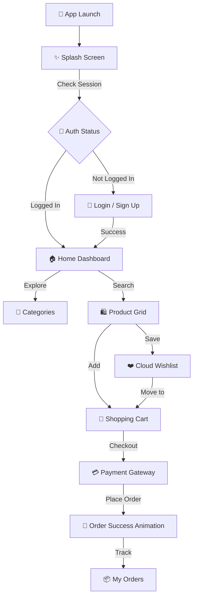

# ✨ Aura Mart — *Elevate Your Shopping Experience* ✨


Aura Mart is a **premium digital storefront** designed with elegance, speed, and high performance in mind. Built using **Flutter** and **Firebase**, it delivers a seamless end-to-end shopping journey from intelligent onboarding to secure order tracking.

---

## 📸 Visual Flow



---

## 💎 Latest Premium Features

*   **⚡ Intelligent Onboarding:** Animated splash screen that manages user sessions and auto-routes.
*   **🛡️ Secure Auth Core:** Real-time Firebase profile syncing and a dedicated Password Recovery system.
*   **🎨 Next-Gen UI:** Features a unique **Floating "Bubble" Navigation Bar** and a sleek design language.
*   **🔍 Smart Discovery:** Real-time search engine and 3-column circular category filtering.
*   **❤️ Cloud-Synced Wishlist:** Save your favorite items to the cloud; they stay with you even after logging out.
*   **🛒 Advanced Cart System:** Full quantity management, swipe-to-delete, and real-time subtotal calculations.
*   **💳 Secure Checkout Flow:** Simulated multi-step payment gateway with a celebratory animation.
*   **📍 Address Management:** Save multiple shipping addresses (Home/Work) with default selection.
*   **📦 Real-time Order Tracking:** View your entire purchase history with detailed, collapsible order cards.
*   **🌙 Dynamic Themes:** Luxurious Deep Purple palette with support for System Light and Dark modes.

---

## 🛣️ The Journey (Workflow)

### 🟢 Phase 1: The Entrance


*   **Immersive Splash:** A high-fidelity animation validates the session.
*   **Identity Guard:** Welcomes known users or guides guests to the Auth Portal.

<br clear="right"/>

### 🔵 Phase 2: Discovery


*   **Branded Dashboard:** Top branding bar, delivery location, and deals slider.
*   **Grid Explorer:** Specialized horizontal deals and a dense product grid.

<br clear="left"/>

### 🟣 Phase 3: Selection & Purchase


*   **Sync Logic:** Real-time wishlist syncing via Firestore.
*   **The Boutique (Cart):** Professional payment selection and subtotal tracking.

<br clear="right"/>

### 🟡 Phase 4: Account & History


*   **Persona (Profile):** Address management and a dedicated "My Orders" screen.

<br clear="left"/>

---

## 📂 Folder Structure (Clean Architecture)
```text
lib/
├── Core/           # Themes, Utils, Constants
├── Screens/        # UI Layer (Auth, Products, Tabs, Splash, Orders)
├── Services/       # Business Logic (Firebase integrations)
└── main.dart       # Entry point
```

---

## 📦 Installation & Setup

1.  **Clone the Vision**
    ```bash
    git clone https://github.com/anshu-ac-dv/aura_mart.git
    ```
2.  **Pull the Assets**
    ```bash
    flutter pub get
    ```
3.  **Bridge to Firebase**
    - Place your `google-services.json` in `android/app/`.
    - Enable **Firestore** and **Auth** in your Firebase console.
4.  **Launch**
    ```bash
    flutter run
    ```

---

## 🤝 Contribution
Designed with ❤️ for the Flutter community. Feel free to fork, star, and contribute to the Aura Mart evolution!

---
*Developed by [Anshu Kumar](https://github.com/anshu-ac-dv)*
