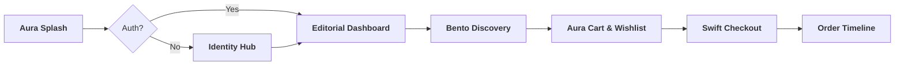

# <p align="center">✨ AURA MART ✨</p>
<p align="center">
  
  
  
</p>

<p align="center">
  <b><i>"The New Standard of Premium E-Commerce Experiences"</i></b><br>
  A high-performance mobile solution featuring an <b>Editorial Bento UI</b>, <b>real-time marketplace synchronization</b>, and <b>ultra-smooth GPU-cached rendering</b>.
</p>

---

## 📸 Visual Identity
<p align="center">
  
  
  
</p>

---

## 🚀 Supercharged Features

- 💎 **Editorial Bento UI**: A unique staggered grid layout for high-end product discovery.
- ⚡ **GPU Acceleration**: Strategic `RepaintBoundary` integration for buttery-smooth 120Hz scrolling.
- 🏪 **Seller Hub**: Fully functional marketplace where users can list items with real-time previews.
- 🕒 **Zero-Lag Engine**: Isolated micro-widgets for high-frequency updates (Deals, Timers).
- 🛡️ **Identity Hub**: Secure Firebase authentication with real-time profile & order synchronization.
- 📉 **Offline Resilience**: Instant launch and data access via optimized Firestore persistence.

---

## 🛠️ Technical Excellence

- **State Management**: Orchestrated by **BLoC (Business Logic Component)** for a predictable, unidirectional data flow and testable architecture.
- **Dependency Injection**: Powered by **GetIt**, ensuring a decoupled and maintainable codebase through a robust service locator pattern.
- **Clean Architecture**: Follows Domain-Driven Design (DDD) principles with clear separation between Data, Domain, and Presentation layers.
- **Performance Optimized**: 
  - Implementation of `RepaintBoundary` to isolate widget repaints and optimize the GPU rendering pipeline.
  - Efficient image caching via `CachedNetworkImage` to reduce network overhead.
  - Staggered animations using custom `AnimationControllers` for a premium feel without dropping frames.

## 📂 Project Structure

```text
lib/
├── core_services/    # Cross-cutting concerns (Theme, Splash, Common Logic)
├── features/         # Modular feature sets (Auth, Cart, Orders, Products)
│   ├── data/         # Repositories & Data Sources implementation
│   ├── domain/       # Business entities & Repository interfaces
│   └── presentation/ # BLoC, Widgets, and Feature-specific screens
├── screens/          # Primary UI entry points and Hubs
├── widgets/          # Reusable Aura UI components
└── main.dart         # App entry point & Provider configuration
```

---

## 📥 Download & Demo
<p align="center">
  <a href="https://github.com/anshu-ac-dv/aura_mart/releases/latest">
    
  </a>
</p>

> **Note :** The latest production-ready APK is available for download via the link above to facilitate application verification and manual testing on physical devices.

---

## 🗺️ Optimized User Journey


```mermaid
graph LR
    A[<b>Aura Splash</b>] --> B{Auth?}
    B -- No --> C[<b>Identity Hub</b>]
    B -- Yes --> D[<b>Editorial Dashboard</b>]
    C --> D
    D --> E[<b>Bento Discovery</b>]
    E --> F[<b>Aura Cart & Wishlist</b>]
    F --> G[<b>Swift Checkout</b>]
    G --> H[<b>Order Timeline</b>]
```

---

## 🛠️ Tech Stack & Architecture

| Category | Technology |
| :--- | :--- |
| **Frontend** | Flutter (Material 3 + Editorial Staggered Grid) |
| **Backend** | Firebase Auth, Firestore (Real-time Streams) |
| **Animation** | Lottie.host (Resilient with Error Fallbacks) |
| **Performance** | GPU Caching, isolated rebuilds, persistent cache |
| **Code Style** | Strict Dart 3.x Snake_Case conventions |

```text
lib/
├── core_services/    # Optimized Logic (Cart, Product, Auth)
├── screens/          # Premium UI Layers
│   ├── tabs/         # Bento Dashboard, Glass Cart, Profile
│   ├── products/     # Category Discovery & Wishlist
│   ├── seller/       # Add Product & Marketplace Hub
│   └── ...           # Secure Login & Recovery
└── main.dart         # Entry point & Optimized Theme
```

---

## ⚙️ Quick Start

1. **Setup**
   ```bash
   git clone https://github.com/anshu-ac-dv/aura_mart.git
   cd aura_mart
   flutter pub get
   ```

2. **Launch**
   - Add `google-services.json` to `android/app/`.
   - Run in release mode for maximum performance:
   ```bash
   flutter run --release
   ```

---

<div align="center">
  <h3>Developed with precision by Anshu Kumar</h3>
  <p>
    <a href="https://github.com/anshu-ac-dv"></a>
    <a href="https://linkedin.com/in/anshu-ac-dv"></a>
  </p>
  <i>"I build software that defines the details."</i>
</div>
