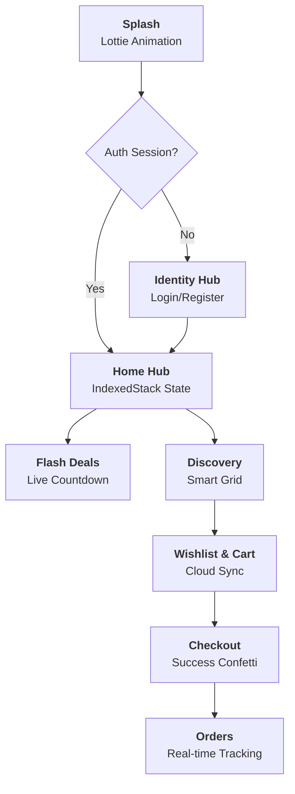

# <p align="center">✨ AURA MART ✨</p>
<p align="center"><i>"The Future of Premium E-Commerce Experiences"</i></p>

<div align="center">

[](https://flutter.dev)
[](https://firebase.google.com)
[](https://dart.dev)
[](https://flutter.dev)

</div>

---

## 💎 Project Overview
**Aura Mart** is a production-grade e-commerce solution built with Flutter. It's not just a shopping app; it's a showcase of **UI/UX precision**, **real-time synchronization**, and **scalable mobile architecture**. Designed to demonstrate the power of high-fidelity mobile engineering with a focus on interactive elements and premium motion design.

---

## 🚀 The User Journey (App Flow)

Aura Mart follows a logical, highly responsive flow designed to minimize friction and maximize engagement:


```mermaid
graph TD
    A[<b>Splash</b><br/>Lottie Animation] --> B{Auth Session?}
    B -- No --> C[<b>Identity Hub</b><br/>Login/Register]
    B -- Yes --> D[<b>Home Hub</b><br/>IndexedStack State]
    
    C --> D
    
    D --> E[<b>Flash Deals</b><br/>Live Countdown]
    D --> F[<b>Discovery</b><br/>Smart Grid]
    
    F --> G[<b>Wishlist & Cart</b><br/>Cloud Sync]
    G --> H[<b>Checkout</b><br/>Success Confetti]
    
    H --> I[<b>Orders</b><br/>Real-time Tracking]
```

---

## 🌟 Interactive Features (New!)

| Feature | Implementation | Value |
| :--- | :--- | :--- |
| **⚡ Flash Deals Timer** | Real-time `Timer` logic on Dashboard. | Creates urgency & dynamic UI. |
| **🚀 Quick Action FAB** | Interactive Floating Action Menu. | Faster access to Support & Coupons. |
| **📊 Profile Stats** | Depth-based activity cards. | Instant summary of user engagement. |
| **🎉 Success Confetti** | Lottie-powered order celebration. | Enhances user gratification. |
| **🔄 State Preservation** | `IndexedStack` navigation. | Seamless tab switching without data loss. |

---

## 🛠️ Engineering Highlights

| Highlight | Technical implementation |
| :--- | :--- |
| **Real-time Engine** | Firestore `StreamBuilder` for live stock & order updates. |
| **Media Optimization** | `cached_network_image` with custom shimmer/fade shaders. |
| **Advanced Auth** | Firebase Auth with multi-screen state & display name sync. |
| **Aura Glass UI** | Custom `Sliver` effects, Gradients, and Glassmorphic cards. |
| **Offline Resilience** | Firestore persistence for instant data access without network. |

---

## 🎨 Design System: "Aura Glass"
The app adheres to a custom design language focusing on **Depth, Motion, and Clarity**:
*   **Visual Hierarchy**: Using `LinearGradients` (Deep Purple & Indigo) to define key action areas.
*   **Motion Language**: Subtle physics-based animations and Lottie-driven feedback loops.
*   **Modern Components**: Glassmorphic search bars, circular category avatars, and high-density product grids.

---

## 🏗️ Architecture
Aura Mart follows a **Clean UI / Service Separation** pattern:

```text
lib/
├── Screens/          # High-fidelity UI & Theme-aware widgets
│   ├── auth/         # Identity Hub (Login, Register)
│   ├── home/         # Dashboard & Detail views
│   └── tabs/         # State-preserved main navigation
├── Services/         # Core business logic (Cart, Wishlist, Orders)
├── Splash Services/  # App bootstrapping & Auth routing
└── main.dart         # Material 3 Theme & App Entry
```

---

## 📦 Tech Stack & Dependencies
*   **Frontend**: Flutter (Material 3)
*   **Backend**: Firebase (Auth, Firestore, Storage)
*   **Animations**: Lottie & Custom Hero transitions
*   **Utilities**: `fluttertoast`, `intl`, `cached_network_image`

---

## 🔧 Installation & Setup

1.  **Clone the Repository**
    ```bash
    git clone https://github.com/anshu-ac-dv/aura_mart.git
    ```
2.  **Environment Setup**
    *   Place `google-services.json` in `android/app/`.
    *   Run `flutter pub get`.
3.  **Execute**
    ```bash
    flutter run --release
    ```

---

<div align="center">
    <h3>Built with ❤️ by Anshu Kumar</h3>
    <p><i>Looking for a Flutter Developer who cares about the details? Let's connect!</i></p>
    
[Portfolio](https://github.com/anshu-ac-dv) • [LinkedIn](https://linkedin.com/in/anshu-ac-dv) • [Email](mailto:anshu.ac.dv@gmail.com)

</div>
