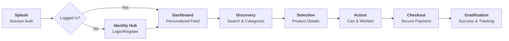

# <p align="center">✨ AURA MART ✨</p>
<p align="center"><i>"The Future of Premium E-Commerce Experiences"</i></p>

<div align="center">

[](https://flutter.dev)
[](https://firebase.google.com)
[](https://dart.dev)
[](https://flutter.dev)

</div>

---

## 💎 Project Overview
**Aura Mart** is a production-grade e-commerce solution built with Flutter. It's not just a shopping app; it's a showcase of **UI/UX precision**, **real-time synchronization**, and **scalable mobile architecture**. Designed for recruiters and developers alike to demonstrate the power of high-fidelity mobile engineering.

---

## 🚀 The User Journey (App Flow)

Aura Mart follows a logical, highly responsive flow designed to minimize friction and maximize engagement:


```mermaid
graph LR
    A[<b>Splash</b><br/>Session Auth] --> B{Logged In?}
    B -- No --> C[<b>Identity Hub</b><br/>Login/Register]
    B -- Yes --> D[<b>Dashboard</b><br/>Personalized Feed]
    
    C --> D
    
    D --> E[<b>Discovery</b><br/>Search & Categories]
    E --> F[<b>Selection</b><br/>Product Details]
    
    F --> G[<b>Action</b><br/>Cart & Wishlist]
    G --> H[<b>Checkout</b><br/>Secure Payment]
    
    H --> I[<b>Gratification</b><br/>Success & Tracking]
```

1.  **Identity Guard**: Real-time Firebase session check on splash.
2.  **Smart Discovery**: Blazing fast search with horizontal category filtering.
3.  **Cloud Sync**: Changes to Wishlist or Cart are persisted instantly across devices via Firestore.
4.  **Transaction flow**: A seamless transition from cart selection to order placement with Lottie-powered visual feedback.

---

## 🛠️ Engineering Highlights

| Feature | Technical Implementation | Recruiter Value |
| :--- | :--- | :--- |
| **Real-time Engine** | Integrated `Firestore` Streams for live updates. | Proficiency in reactive programming. |
| **Media Optimization** | `cached_network_image` with custom loading shaders. | Performance-first mindset. |
| **Advanced Auth** | Firebase Auth with multi-screen state management. | Security-centric development. |
| **Premium UI** | Custom `Sliver` effects & `Lottie` micro-interactions. | High attention to UX/UI detail. |
| **Offline Support** | Optimistic UI updates with Firestore persistence. | Resilient app architecture. |

---

## 🎨 Design System: "Aura Glass"
The app adheres to a custom design language focusing on **Depth, Motion, and Clarity**:
*   **Visual Hierarchy**: Using `LinearGradients` (Deep Purple & Indigo) to define key action areas.
*   **Motion Language**: Subtle physics-based animations and Lottie-driven feedback loops.
*   **Modern Components**: Glassmorphic search bars, circular category avatars, and high-density product grids.

---

## 📦 Core Technical Stack
*   **Frontend**: Flutter (Material 3)
*   **State Management**: Service-based reactive state.
*   **Backend**: Firebase (Authentication, Firestore, Storage).
*   **Animations**: Lottie & Custom Hero transitions.
*   **Performance**: Intelligent image caching and memory-efficient list rendering.

---

## 🌟 Key Features Deep-Dive

### 👤 Identity Hub
*   **Secure Authentication**: robust login and registration flows backed by Firebase.
*   **Persistent Sessions**: Immediate redirection based on user auth state during splash.

### 🛍️ Smart Boutique
*   **Discovery Engine**: Real-time product filtering by category and name with sub-second latency.
*   **Wishlist & Cart**: Bi-directional sync with Firestore—add a product on one screen, see it updated globally.

### 💳 Transaction Suite
*   **Dynamic Checkout**: Adaptive payment selection (COD/Online) with success-state Lottie animations.
*   **Order History**: Detailed tracking of past purchases with server-synced timestamps and media thumbnails.

---

## 🏗️ Project Architecture
Aura Mart follows a **Clean UI/Service separation** pattern, ensuring the codebase remains maintainable and testable:

```text
lib/
├── Screens/          # High-fidelity UI & Theme-aware widgets
├── Services/         # Core business logic & Firebase integration
├── Splash Services/  # App bootstrapping & Auth state management
└── main.dart         # App entry point
```

---

## 🔧 Installation & Setup

1.  **Clone the Repository**
    ```bash
    git clone https://github.com/anshu-ac-dv/aura_mart.git
    ```
2.  **Environment Setup**
    *   Place `google-services.json` in `android/app/`.
    *   Run `flutter pub get`.
3.  **Execute**
    ```bash
    flutter run --release
    ```

---

<div align="center">
    <h3>Built with ❤️ by Anshu Kumar</h3>
    <p><i>Looking for a Flutter Developer who cares about the details? Let's connect!</i></p>
    
[Portfolio](https://github.com/anshu-ac-dv) • [LinkedIn](https://linkedin.com/in/anshu-ac-dv) • [Email](mailto:anshu.ac.dv@gmail.com)

</div>
