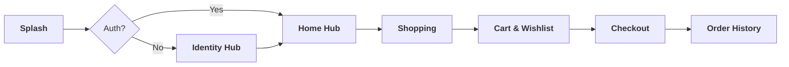

# <p align="center">✨ AURA MART ✨</p>
<p align="center">
  
  
  
</p>

<p align="center">
  <b><i>"The Future of Premium E-Commerce Experiences"</i></b><br>
  A production-grade mobile solution focused on <b>UI/UX precision</b>, <b>real-time sync</b>, and <b>premium motion design</b>.
</p>


## 🚀 Key Features

- 💎 **Aura Glass UI**: Custom design system featuring glassmorphic cards and physics-based animations.
- ⚡ **Real-time Engine**: Powered by Firestore Streams for instant cart and order updates.
- 🎉 **Micro-interactions**: Lottie-powered success celebrations and smooth hero transitions.
- 🛡️ **Identity Hub**: Secure Firebase authentication with real-time profile synchronization.
- 📉 **Offline Resilience**: Instant data access even without connectivity via Firestore persistence.

---

## 🗺️ The User Journey


```mermaid
graph LR
    A[<b>Splash</b>] --> B{Auth?}
    B -- No --> C[<b>Identity Hub</b>]
    B -- Yes --> D[<b>Home Hub</b>]
    C --> D
    D --> E[<b>Shopping</b>]
    E --> F[<b>Cart & Wishlist</b>]
    F --> G[<b>Checkout</b>]
    G --> H[<b>Order History</b>]
```

---

## 🛠️ Tech Stack & Architecture

| Category | Technology |
| :--- | :--- |
| **Frontend** | Flutter (Material 3) |
| **Backend** | Firebase Auth & Firestore |
| **Animations** | Lottie, Custom Animations |
| **Media** | Cached Network Image |
| **Patterns** | Clean UI / Service Separation |

```text
lib/
├── Screens/          # UI Layers (Auth, Home, Tabs)
├── Services/         # Logic Layers (Cart, Orders, Payment)
├── Splash Services/  # Bootstrapping & Auth Routing
└── main.dart         # Entry point & Global Theme
```

---

## ⚙️ Quick Start

1. **Clone & Install**
   ```bash
   git clone https://github.com/anshu-ac-dv/aura_mart.git
   cd aura_mart
   flutter pub get
   ```

2. **Firebase Setup**
   - Place your `google-services.json` in `android/app/`.

3. **Run**
   ```bash
   flutter run --release
   ```

---

<div align="center">
  <h3>Crafted with ❤️ by Anshu Kumar</h3>
  <p>
    <a href="https://github.com/anshu-ac-dv"></a>
    <a href="https://linkedin.com/in/anshu-ac-dv"></a>
  </p>
  <i>"I build software that cares about the details."</i>
</div>
